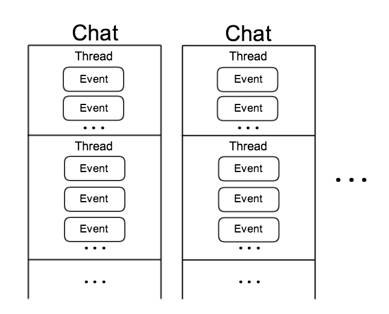

# Introduction

Hello there 👋! This article aims to explain the basic concepts behind chat.io APIs.

The chat.io APIs let you **handle online conversations**. It means you can send and receive messages, exchange events and perform other actions within the chat.io system. 

We designed the communication protocol to handle all kinds of information: rich messages, events or nested data structures. APIs provided by chat.io break down the complexity of an online conversation, so you can focus on solving your business case.

## APIs Overview

There are two primary APIs available:

- [Agent API](../agent-api) used when performing a chat from the agents perspective,
- [Customer API](../customer-api)  used to chat on behalf of the customer (visitor).

Both have much in common. The differences come from their use cases and are reflected in exposed methods. 

See the diagram below to understand the basic flow of information between services. The animation explains the simple chat flow: from logging in, through starting a chat, with ending at sending events.

<video loop width="750" height="500" controls>
<source type="video/mp4" src="/docs/apis-overview/images/simple_event_schema.mp4">
</video>

## Chats and threads

The primary object describing a conversation is a **chat**. Each chat is divided into **threads**. Every thread may contain **events**. You can find more about the events in the [Events](#events) section.

Multiple users can participate in a single chat. Every user can have multiple chats at the same time.

New threads within a single chat are created on the server side. If you're curious about the creation algorithm, see [Rules and conditions](#rules-and-conditions).

Events are portions of data which can be sent to a chat (e.g. in messages). See the next section of this guide for details (coming soon).

### Rules and conditions

 1. Only one of the threads within a chat may be the **active thread**. When you send events to the chat, they will be added to the **active thread**. Only the **last thread** can be the active one.
 
 2. Chats are **not continous**, there can be time gaps between the threads.
 
 3. When there is no active thread in the chat, sending an event to that chat will start **a new thread**. For instance when the last active thread has been closed, sending an event to the same chat will open up a new thread. The annotation event is an exception here, it will be added at the end of the last thread.
 
 4. When a new chat is started, **a new thread** is created within that chat.
 
 5. The algorithm which decides how the chats are distributed between the agents is called **routing** and is documented in the [Routing](#routing) section.
