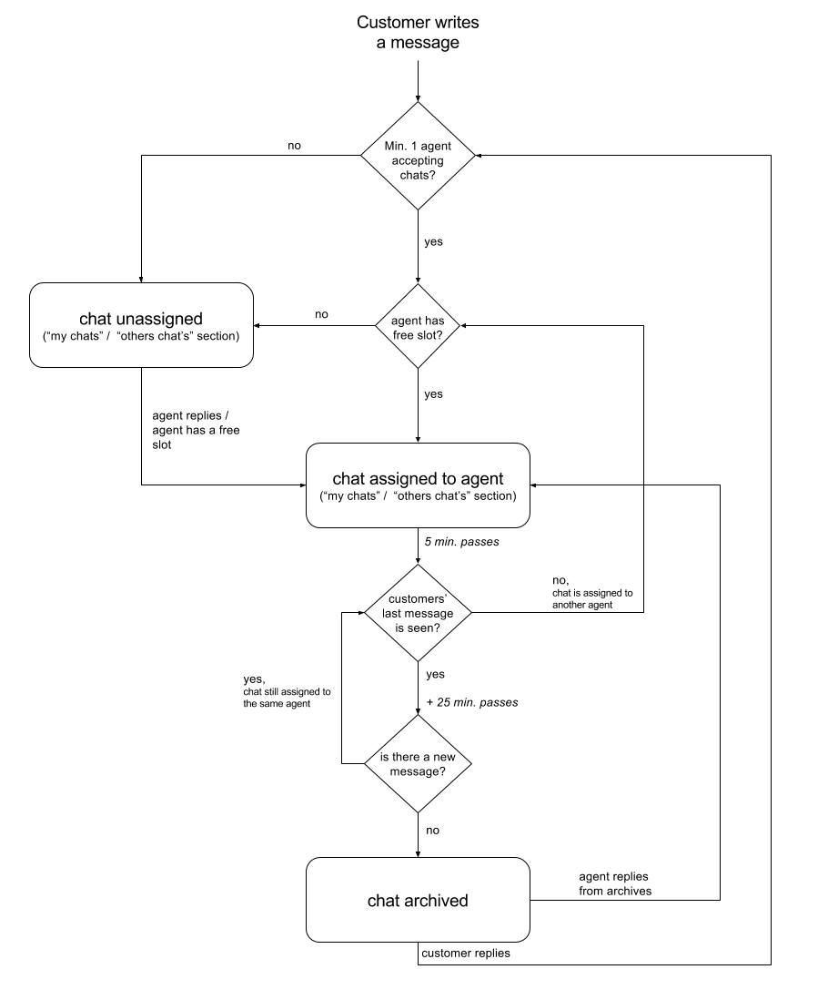

# Routing

Routing is an mechanism which decides how chats within a single license are distributed between the agents. This document describes chat.io product routing but in the future you will be able to write your own routing mechanism and run it on our platform.

In chat.io product it's not possible for a customer to have multiple chats within a single license. The conversation within a license (i.e. a company) is continuous from the customer's perspective and it's not necessary to split it into multiple chats. Agents are assigned to this chat either automatically or manually depending on the routing settings.

## Automatic routing

## Manual routing

## System messages

While routing switches states (as shown in diagrams), the router will send some system messages (see [Events](../events#system-message) section) to the chat.

| Message text | System message type |
|--------------|---------------------|
| `Chat assigned to <agent_name>` | `routing.assigned` |

cases:

 - new chat and an agent is available (automatic routing)
 - agent left the chat and another agent is available (automatic routing)
 - agent got available for unassigned chat (automatic routing)

| Message text | System message type |
|--------------|---------------------|
| `Chat is unassigned` | `routing.unassigned` |

cases:

 - agent left the chat and there were no other agents available (automatic routing)
 - no free agent slots (automatic routing)
 - chat is unnasigned (manual routing)

| Message text | System message type |
|--------------|---------------------|
| `Chat is unassigned because <agent_name> hasn't replied in <minutes_number> minutes` | `routing.unassigned` |
| `Chat assigned to <agent_name> because <agent_name> hasn't replied in <minutes_number> minutes` | `routing.assigned` |
| `Chat archived due to long inactivity` | `routing.archived` |
| `Chat is idle due to <minutes_number> minutes of inactivity` | `routing.idle` |
| `Chat archived because customer was banned by <agent> for N days` | `customer_banned` |